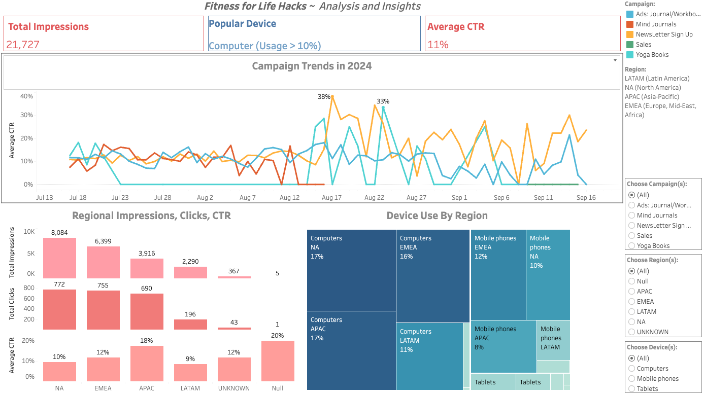

# _Fitness Hacks for Life_ ~ Wellness eCommerce Insights

**_This project analyzes Fitness Hacks for Life (FHFL), a wellness platform and eCommerce site, by evaluating its digital ad campaigns using Google Ads, Google Analytics, and Tableau. FHFL promotes mental well-being through empathy, compassion, and evidence-based resources. The dashboard provides insights into campaign performance across regions and devices, with the goal of optimizing outreach and increasing FHFL's impact. Alongside mental health content—such as expert-driven articles, podcasts, and tools like personalized journals and stress-relief workbooks—FHFL’s eCommerce store offers products designed to support overall well-being, creating a holistic space for mental health and community connection._**

## Dashboard

You can access the [Dashboard here](https://public.tableau.com/app/profile/z.w8482/viz/FHFL_Project/Dashboard1)

## Notable Terms Defined
- **Impressions:** The number of times an ad is displayed to users.
- **Click-Through Rate (CTR):** The percentage of impressions that resulted in a click, calculated as (Total Clicks / Total Impressions) * 100.
- **Campaign:** A coordinated series of advertisements aimed at promoting a product or service over a period of time.
- **Regions:** Geographical breakdowns used in the analysis:
  - **APAC:** Asia-Pacific
  - **LATAM:** Latin America
  - **EMEA:** Europe, Middle East, and Africa
  - **NA:** North America
  - **Devices:** The platforms through which users access the content, including computer, mobile, and tablet.

## Relevant Key Performance Indicators (KPIs)
- **Total Impressions:** Measure of how often the ad was viewed.
- **Average CTR:** Indicator of ad effectiveness, showing the ratio of clicks to impressions.
- **Clicks by Region:** Insights into which regions (APAC, LATAM, EMEA, NA) are more engaged with campaigns.
- **% Device Use by Region:** Distribution of device usage (computer, mobile, tablet) to understand platform preferences in different regions.

## Project Goals
1. **Optimize Marketing Efforts:** Identify high and low-performing regions and campaigns to reallocate resources effectively.
2. **Improve Engagement:** Tailor campaign strategies based on device preferences and regional performance to better meet the needs of FHFL's audience.
3. **Enhance Data-Driven Decisions:** Provide key stakeholders with actionable insights to increase ROI, improve user engagement, and contribute to FHFL’s mission of destigmatizing mental health and supporting a compassionate community.

## Insights Gleaned

### Campaign Trends Over Time

In summary, the ads for journals/workbooks, mind journals, and the newsletter signup were consistently active, whereas the Yoga Books and Sales campaigns ran intermittently. The newsletter signup campaign had a notably higher CTR compared to the others, frequently exceeding 20% on certain days, indicating strong customer interest in email subscriptions.

- **Ads for Journals/Workbooks:** The CTR fluctuated between 0% and 18.06%, showing a steady performance over time but experiencing dips around late August and early September (e.g., 2.50% on August 31).
- **Mind Journals:** Had relatively steady performance in the 5%-16% range but showed a notable drop to 0% on many days after August 11.
- **Newsletter Sign Up:** This campaign performed well, frequently exceeding 10% CTR. Peaks were observed, such as 34.29% on August 22 and 26.32% on September 9, indicating high interest in signing up for updates.
**Yoga Books:** Performance was inconsistent with multiple instances of 0% CTR, though it had notable peaks on August 15 (25%), August 16 (28.57%), and September 4 (25%).
**Sales:** While introduced late in the period, this campaign showed 0% CTR across the board, suggesting it struggled to capture attention.
2. **Campaign Performance Peaks**
  August 22 was an exceptional day for Newsletter Sign Up, with 34.29% CTR.
September 9 was another strong day for Newsletter Sign Up, with 26.32% CTR, indicating periods of heightened user engagement around email sign-ups.
5. **Declining or Inconsistent Performance**
   Mind Journals showed a concerning drop after August 11, with 0% CTR on multiple occasions despite continued impressions.
Ads for Journals/Workbooks also faced inconsistency, with dips below 5% CTR during the last week of August and the first week of September.
Yoga Books frequently had days with 0% CTR, showing inconsistency in user interest.

**Recommendations**
Newsletter Sign Up Optimization: Since this campaign showed strong performance, consider leveraging this by offering additional incentives, exclusive content, or targeted follow-ups to further increase engagement and conversions.
Mind Journals Campaign: Investigate why the CTR dropped to 0% on several days after August 11. It could be due to lack of relevance, outdated content, or changes in targeting.
Ads for Journals/Workbooks: This campaign had periods of strong performance but also showed some volatility. Regular monitoring and optimization (e.g., A/B testing, refreshing ad content) could help smooth out the dips and maintain high engagement.
Focus on Consistency: Campaigns like Yoga Books and Sales need better strategy refinement to avoid consistently low performance. Revisiting the ad copy, targeting, or offers may help boost CTR.
Broaden Impressions for Underperforming Campaigns: For campaigns with lower impressions, such as Yoga Books and Mind Journals, experiment with different keywords, audience segmentation, or platforms to increase reach.

### Regions, Impressions, Clicks, CTR 

