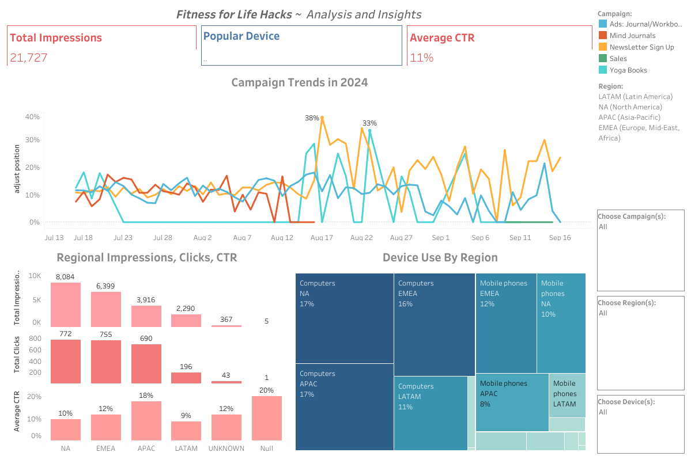

# _Fitness Hacks for Life_ ~ Wellness eCommerce Insights

**_This project analyzes Fitness Hacks for Life (FHFL), a wellness platform and eCommerce site, by evaluating its digital ad campaigns using Google Ads, Google Analytics, and Tableau. FHFL promotes mental well-being through empathy, compassion, and evidence-based resources. The dashboard provides insights into campaign performance across regions and devices, with the goal of optimizing outreach and increasing FHFL's impact. Alongside mental health content—such as expert-driven articles, podcasts, and tools like personalized journals and stress-relief workbooks—FHFL’s eCommerce store offers products designed to support overall well-being, creating a holistic space for mental health and community connection._**

## Dashboard

You can access the [Dashboard here](https://public.tableau.com/app/profile/z.w8482/viz/FHFL_Project/Dashboard1)

## Notable Terms Defined
- **Impressions:** The number of times an ad is displayed to users.
- **Click-Through Rate (CTR):** The percentage of impressions that resulted in a click, calculated as (Total Clicks / Total Impressions) * 100.
- **Campaign:** A coordinated series of advertisements aimed at promoting a product or service over a period of time.
- **Regions:** Geographical breakdowns used in the analysis:
  - **APAC:** Asia-Pacific
  - **LATAM:** Latin America
  - **EMEA:** Europe, Middle East, and Africa
  - **NA:** North America
  - **Devices:** The platforms through which users access the content, including computer, mobile, and tablet.

## Relevant Key Performance Indicators (KPIs)
- **Total Impressions:** Measure of how often the ad was viewed.
- **Average CTR:** Indicator of ad effectiveness, showing the ratio of clicks to impressions.
- **Clicks by Region:** Insights into which regions (APAC, LATAM, EMEA, NA) are more engaged with campaigns.
- **% Device Use by Region:** Distribution of device usage (computer, mobile, tablet) to understand platform preferences in different regions.

## Project Goals
1. **Optimize Marketing Efforts:** Identify high and low-performing regions and campaigns to reallocate resources effectively.
2. **Improve Engagement:** Tailor campaign strategies based on device preferences and regional performance to better meet the needs of FHFL's audience.
3. **Enhance Data-Driven Decisions:** Provide key stakeholders with actionable insights to increase ROI, improve user engagement, and contribute to FHFL’s mission of destigmatizing mental health and supporting a compassionate community.
