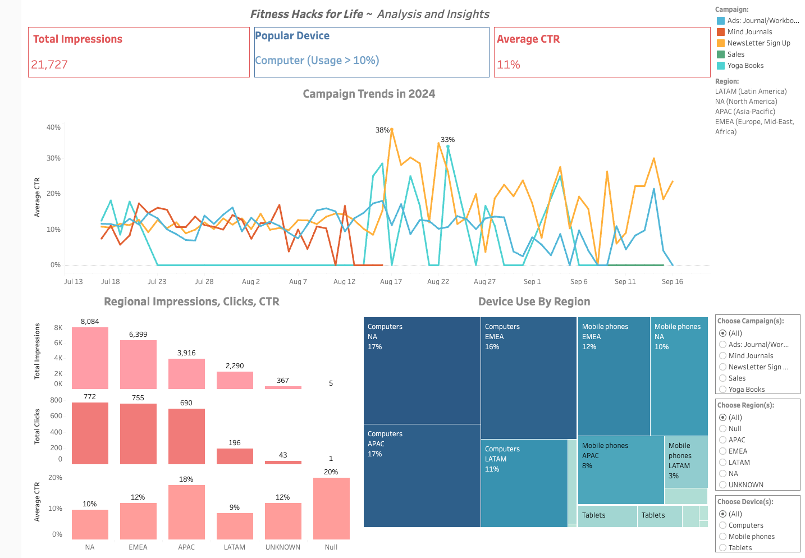

# _Fitness Hacks for Life_ ~ Wellness eCommerce Insights

**_This project analyzes Fitness Hacks for Life (FHFL), a wellness platform and eCommerce site, by evaluating its digital ad campaigns using Google Ads, Google Analytics, and Tableau. FHFL promotes mental well-being through empathy, compassion, and evidence-based resources. The dashboard provides insights into campaign performance across regions and devices, with the goal of optimizing outreach and increasing FHFL's impact. Alongside mental health content—such as expert-driven articles, podcasts, and tools like personalized journals and stress-relief workbooks—FHFL’s eCommerce store offers products designed to support overall well-being, creating a holistic space for mental health and community connection._**

## Dashboard

You can access the [Dashboard here](https://public.tableau.com/app/profile/z.w8482/viz/FHFL_Project/Dashboard1)

To view the entity relationship diagram, click [here](images/FHFL_ERD.png)

## Project Overview

### Understanding Key Terms:

- **Impressions:** Measures how many times FHFL ads were shown to useres.
- **Click-Through Rate (CTR):** Indicates how effective FHFL ads are, showing the percentage of viewers who clicked on them.
- **Campaign:** A series of ads focused on promoting a specific product or service.
- **Regions:** Geographical breakdowns used in the analysis:
  - **APAC:** Asia-Pacific
  - **LATAM:** Latin America
  - **EMEA:** Europe, Middle East, and Africa
  - **NA:** North America
  - **Devices:** The platforms through which users access the content (computer, mobile,tablet).

## Key Performance Indicators (KPIs)
- **Total Impressions:** How often ads were viewed
- **Average CTR:** A measure of how many viewers found FHFL ads engaging
- **Clicks by Region:** Which regions are most responsive to campaigns
- **% Device Use by Region:** Distribution of device usage (computer, mobile, tablet) to understand platform preferences in different regions.

## Project Goals
1. **Optimize Marketing Efforts:** Identify high and low-performing regions and campaigns to reallocate resources effectively.
2. **Improve Engagement:** Tailor campaign strategies based on device preferences and regional performance to better meet the needs of FHFL's audience.
3. **Enhance Data-Driven Decisions:** Use insights to increase return on investment (ROI) and support FHFL's mission to provide accessible mental health resources.

## Insights and Performance Overview 

### What We Learned:
- **Successful Campaigns:** The ads for journals/workbooks and newsletter signups demonstrated consistent activity throughout the campaign period. The newsletter signup campaign stood out, achieving an impressive click-through rate (CTR) that frequently exceeded 20% on select days, indicating a strong interest in email subscriptions.
- **Challenges with Certain Campaigns:** In contrast, the Yoga Books and Sales campaigns exhibited erratic performance, often showing 0% CTR on multiple occasions. This inconsistency suggests a need for deeper analysis and strategy adjustments to enhance engagement.
### Regional Performance:
- **North America** led with over 8,000 impressions, suggesting a larger audience or stronger engagement.
- **EMEA** was close behind, but **LATAM** and **APAC** need more targeted efforts to increase their engagement.
### Device Insights:
- **Desktop Usage:** High in NA and APAC, indicating that these audiences engage more in professional settings.
* **Mobile Usage:** EMEA showed the strongest mobile engagement, suggesting we should prioritize mobile-friendly content there.

## Conclusions and Opportunities
- **Focus on LATAM:** To boost performance, we need to improve our ad targeting and content to better resonate with this audience.
- **Leverage Newsletter Success:** We should consider incentives for newsletter signups to further increase conversions.
- **Investigate Declining Mind Journals:** We must analyze why this campaign's performance dropped to make necessary adjustments.
- **Enhance Mobile Experience:** Tailoring content for mobile users in EMEA can unlock additional engagement opportunities.

## Measurable Goals for the Next Six Months
1. **Increase Newsletter Conversions:** Aim for a 20% increase by offering targeted follow-ups.
2. **Improve Mind Journals CTR:** Target at least 5% in the next month by refining our content.
3. **Boost Mobile CTR:** Increase by 10% in EMEA and APAC within two months.
4. **Enhance Desktop Engagement:** Achieve a 15% increase in NA and APAC through optimized content.

By focusing on these goals and implementing our insights, FHFL can enhance engagement and effectively support its mission of promoting mental health awareness.

_**Important CTR Note:**_ Campaigns with lower impressions often experience more significant fluctuations in both CTR and total clicks. This should be taken into account when analyzing the data.

